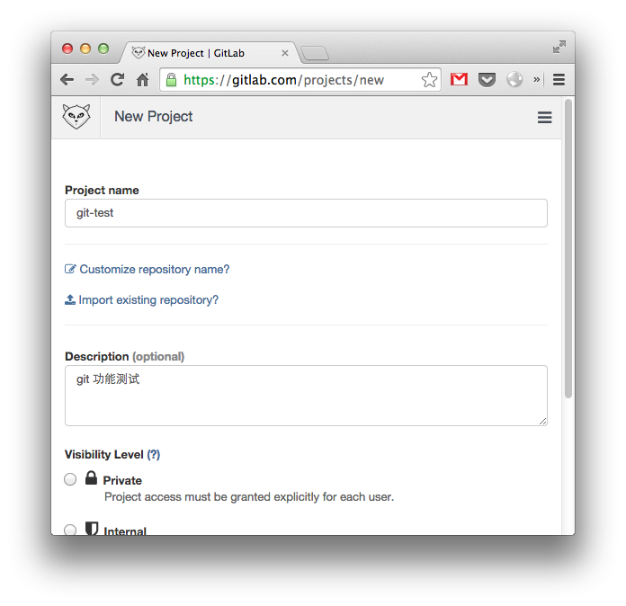
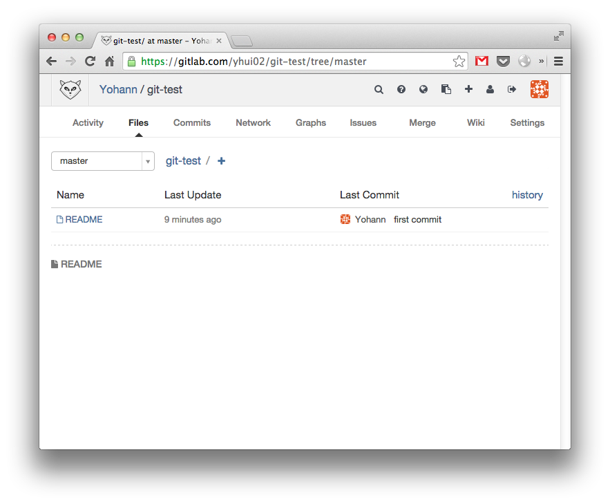
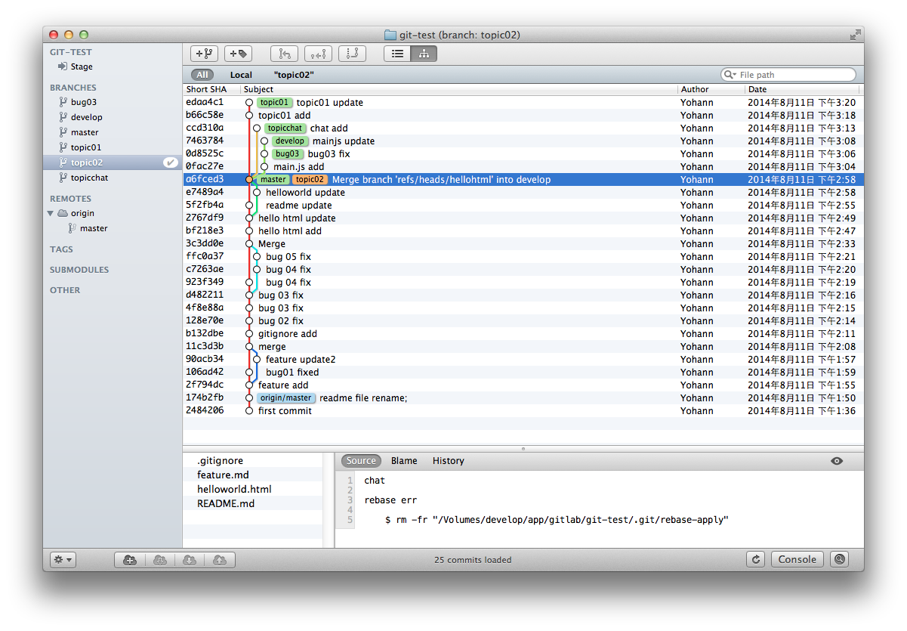

Git demo
=========

使用Git进行项目版本控制示例，服务器端使用开源的[GitLab](https://about.gitlab.com/)，客户端使用命令行与GitX(OS X)。

0. [创建项目](https://gitlab.com/projects/new)`git-test`

	> https://gitlab.com/yhui02/git-test

	
	
	得到[git-test项目](https://gitlab.com/yhui02/git-test.git)（https）

	**Git 全局设置：**
	
		git config --global user.name "YourName"
		git config --global user.email "email@test.com"
	
	**方式一：本地全新创建**
	
		mkdir git-test
		cd git-test
		git init
		touch README
		git add README
		git commit -m 'first commit'
		git remote add origin https://gitlab.com/yhui02/git-test.git
		git push -u origin master
		
	**方式二：已存在项目操作**
	
		cd existing_git_repo
		git remote add origin https://gitlab.com/yhui02/git-test.git
		git push -u origin master
	
	进入[https://gitlab.com/yhui02/git-test/tree/master](https://gitlab.com/yhui02/git-test/tree/master)，查看
	
	

0. 分支创建、合并，模拟4.0开发过程

	